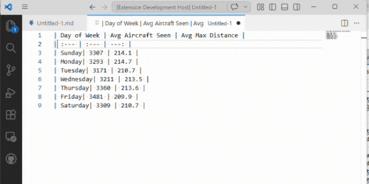
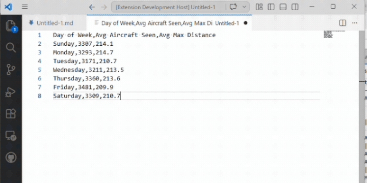
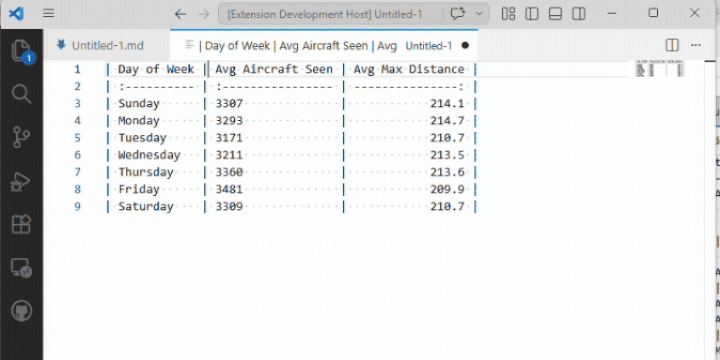

# Markdown Forge

Powerful Markdown table editing and authoring tools for Visual Studio Code.

Markdown Forge makes working with tables fast and ergonomic — align columns, navigate between cells with Tab, insert and reorder rows and columns, sort data, and paste links or images with a keystroke.

## Demo

## Features

### Table editing

- **Align table** — Clean up any table with one command. Columns line up, alignment markers (`:---`, `:---:`, `---:`) are preserved, and escaped pipes inside cells round-trip safely.
- **Navigate with Tab** — Tab moves to the next cell, Shift+Tab to the previous. Tab on the last cell adds a new row.
- **Enter adds a row** — Enter inside a table moves to the first cell of the next row, creating one if needed.
- **Insert / delete rows and columns** — From the Command Palette or bind your own keys.
- **Move rows and columns** — Reorder without retyping.
- **Sort by column** — Sort ascending or descending. Numeric columns are detected automatically.
- **Convert selection to table** — Select pasted CSV or TSV data, run the command, get a formatted Markdown table.

### Insertion commands

- **Paste Link** — If the clipboard contains a URL, wrap the selection (or prompt for text) and insert `[text](url)`.
- **Paste Image** — Save the clipboard image to a configurable folder and insert a Markdown image reference. *Windows only in v0.x; macOS and Linux support is tracked in [#4](https://github.com/dvlprlife/Markdown-Forge/issues/4) and [#5](https://github.com/dvlprlife/Markdown-Forge/issues/5).*

## Keybindings

| Shortcut | Command |
| --- | --- |
| `Tab` | Next cell (when inside a table) |
| `Shift+Tab` | Previous cell (when inside a table) |
| `Enter` | Next row (when inside a table) |
| `Ctrl+Shift+T` / `Cmd+Shift+T` | Align table |
| `Ctrl+Alt+V` / `Cmd+Alt+V` | Paste image |

All other commands are available through the Command Palette (search for "Markdown Forge").

## Settings

| Setting | Default | Description |
| --- | --- | --- |
| `markdownForge.alignOnSave` | `false` | Align all tables in the file when saving. |
| `markdownForge.defaultAlignment` | `"left"` | Alignment for new columns. |
| `markdownForge.imageFolder` | `"images"` | Folder (relative to the file) where pasted images are saved. |
| `markdownForge.imageNameFormat` | `"image-${timestamp}"` | Template for pasted image filenames. Tokens: `${timestamp}`, `${date}`, `${filename}`. |

## Requirements

- Visual Studio Code 1.85 or later.

## Issues and feedback

Please file issues and feature requests on [GitHub](https://github.com/dvlprlife/Markdown-Forge).

## License

MIT
