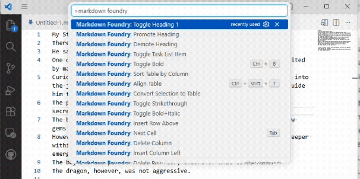
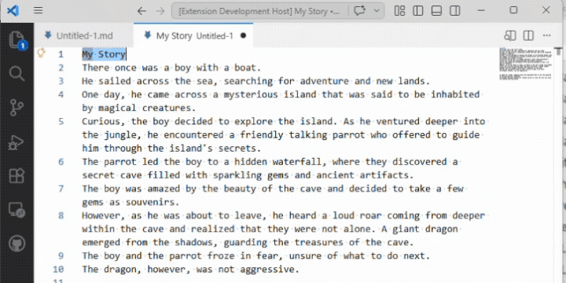
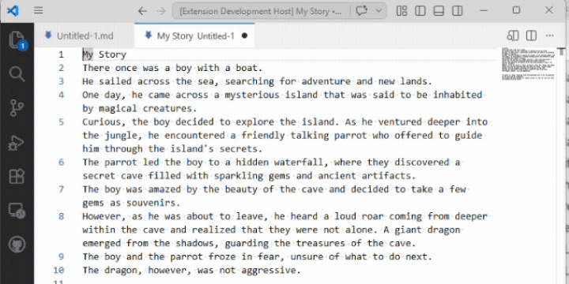
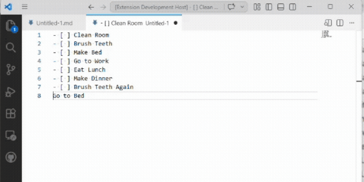

# Markdown Foundry

Powerful Markdown editing tools for Visual Studio Code — table-centric ergonomics plus formatting toggles for everyday authoring.

Markdown Foundry combines fast table editing with one-keystroke Markdown formatting. Align tables, navigate cells with Tab, sort columns, paste links and images — and toggle bold, italic, blockquotes, code blocks, headings, and task lists from the palette or keybindings.

## Demo




## Features

### Table editing

- **Align table** — Clean up any table with one command. Columns line up, alignment markers (`:---`, `:---:`, `---:`) are preserved, and escaped pipes inside cells round-trip safely.
- **Navigate with Tab** — Tab moves to the next cell, Shift+Tab to the previous. Tab on the last cell adds a new row.
- **Enter adds a row** — Enter inside a table moves to the first cell of the next row, creating one if needed.
- **Insert / delete rows and columns** — From the Command Palette or bind your own keys.
- **Move rows and columns** — Reorder without retyping.
- **Sort by column** — Sort ascending or descending. Numeric columns are detected automatically.
- **Convert selection to table** — Select pasted CSV or TSV data, run the command, get a formatted Markdown table.
- **Insert Table** — Pick from preset sizes (2×2 through 5×4) or enter custom dimensions; a pre-aligned table is inserted at the cursor with the first header cell selected.

### Insertion commands

- **Paste Link** — If the clipboard contains a URL, wrap the selection (or prompt for text) and insert `[text](url)`.
- **Paste Image** — Save the clipboard image to a configurable folder and insert a Markdown image reference. On Linux, requires `xclip` (X11) or `wl-clipboard` (Wayland) to be installed.

### Formatting

- **Toggle bold / italic / bold+italic / strikethrough** — wrap a selection with the Markdown marker; re-invoke to unwrap. With no selection, inserts the doubled markers with the cursor between them.

  

- **Toggle blockquote** — prefix every non-empty line in the selection with `> `; re-invoke to strip the prefix.
- **Toggle block code** — wrap the selection with fenced ` ``` ` lines; re-invoke to remove the fence.
- **Toggle bullet list / numbered list** — prefix every non-empty line in the selection with `- ` or with sequential `1.`/`2.`/`3.`; re-invoke to strip. Leading indentation preserved for nested lists.
- **Toggle inline code** — wrap the selection with single backticks; re-invoke to unwrap.
- **Toggle heading levels 1–6** — set the current line to the chosen heading level, or remove the heading if it's already at that level. Plus **Promote / Demote heading** to shift the existing level by one (clamped to H1–H6).

  

- **Toggle task list item** — cycle the current line through plain → `- [ ] todo` → `- [x] done` → `- [ ] todo` …, preserving leading indentation.

  
- **Insert horizontal rule** — drop a `---` line below the cursor's current line.

## Keybindings

| Shortcut | Command |
| --- | --- |
| `Tab` | Next cell (when inside a table) |
| `Shift+Tab` | Previous cell (when inside a table) |
| `Enter` | Next row (when inside a table) |
| `Ctrl+Shift+T` / `Cmd+Shift+T` | Align table |
| `Ctrl+Alt+V` / `Cmd+Alt+V` | Paste image |
| `Ctrl+B` / `Cmd+B` | Toggle bold (when editing a Markdown file) |
| `Ctrl+I` / `Cmd+I` | Toggle italic (when editing a Markdown file) |

All other commands are available through the Command Palette (search for "Markdown Foundry").

## Settings

| Setting | Default | Description |
| --- | --- | --- |
| `markdownFoundry.alignOnSave` | `false` | Align all tables in the file when saving. |
| `markdownFoundry.defaultAlignment` | `"left"` | Alignment for new columns. |
| `markdownFoundry.imageFolder` | `"images"` | Folder (relative to the file) where pasted images are saved. |
| `markdownFoundry.imageNameFormat` | `"image-${timestamp}"` | Template for pasted image filenames. Tokens: `${timestamp}`, `${date}`, `${filename}`. |

## Requirements

- Visual Studio Code 1.85 or later.

## Issues and feedback

Please file issues and feature requests on [GitHub](https://github.com/dvlprlife/Markdown-Foundry).

## License

MIT
